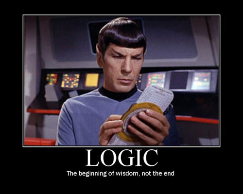

#2015 Merit Badge University
# @Harvard
### Programming Badge

---
= data-x="1000" data-scale="1"
# Instructors
- Stephen Bosak (sbosak@gmail.com)
- Dan Kurtzer (dsk19360@gmail.com)
- Willy Xiao (wxiao@college.harvard.edu)
- Natalie Westerman (nlwesterman@gmail.com)
- John Byrnes (john@johnbyrnes.info)

- Please email [MBU2015@gmail.com](mailto:mbu2015@gmail.com) on every email you send.

---
= data-x="1000" data-scale="1" data-rotate-x="90"
# Your responsibilities
- [Cyberchip](http://www.scouting.org/cyberchip.aspx)
- Filling out your forms
- Doing your own work!

---
= data-x="1000" data-scale="1"
# Our responsibilities
- Providing guidance and instruction
- Grading in a timely manner
- Signing off your blue cards

---
= data-x="1000" data-scale="1"
## Do not have your parents contact us for help.
- You are responsible for earning the badge, not your parents.
- Email any or all of the instructors and we will help you.
- *Please* email [MBU2015@gmail.com](mailto:mbu2015@gmail.com) on
  every email you send.

---
= data-x="1000" data-scale="1" data-rotate-x="90"
## 1. Cyberchip (You!)

You should already have this done.

If not, go [here](http://www.scouting.org/cyberchip.aspx).

---
= data-x="1000" data-scale="1" data-rotate-x="90"
## 2. History (You!)

###Do the following:

 - Give a brief history of programming, including at least three
   milestones related to the advancement or development of
   programming.
 - Describe the evolution of programming methods and how they have
   improved over time.

---
= data-x="1000" data-scale="1" data-rotate-x="90"
## 3. General Knowledge (You!)

###Do the following:

 - Create a list of 10 popular programming languages in use today and describe which industry or industries they are primarily used in and why.
 - Describe three different programmed devices you rely on every day.

---
= data-y="1000" data-scale="1" data-rotate-x="90"
## 4. Intellectual Property (Mix)

###Do the following:

- Explain how software patents and copyrights protect a programmer.
- Describe the difference between licensing and owning software.
- Describe the differences between freeware, open source, and
  commercial software, and why it is important to respect the terms of
  use of each.

---
= data-y="1000" data-scale="1" data-rotate-y="90"
# 5. Actual Programming Projects!!! (Us!)
###(This is the fun one)

---
###Do the following:

- With your counselor’s approval, choose a sample program. Then, as a
  minimum, modify the code or add a function or subprogram to
  it. Debug and demonstrate the modified program to your counselor.
- With your counselor’s approval, choose a second programming language
  and development environment, different from those used for
  requirement 5a and in a different industry from 5a. Then write,
  debug, and demonstrate a functioning program to your counselor,
  using that language and environment.
- With your counselor’s approval, choose a third programming language
and development environment, different from those used for
requirements 5a and 5b and in a different industry from 5a or 5b. Then
write, debug, and demonstrate a functioning program to your counselor,
using that language and environment.  Explain how the programs you
wrote for requirements 5a, 5b, and 5c process inputs, how they make
decisions based on those inputs, and how they provide outputs based on
the decision making.

---
= data-y="1000" data-scale="1" data-rotate-y="90"
# 6. Careers (You!)

Find out about three career opportunities in programming. Pick one and
find out the education, training, and experience required. Discuss
this with your counselor and explain why this career might be of
interest to you.

---

## We have a few suggestions.

Although the rules say that you can choose any programming languages
you want, we would like to suggest three:

- [Python](https://www.python.org/)
- [C++](https://en.wikipedia.org/wiki/C%2B%2B)
- [Mozilla AppMaker](https://apps.webmaker.org/designer)

We have the most experience with these languages and should be able to
help you effectively.

---
##Tools

In order for us to get up to speed quickly, we're going to use some
online tools:

- [Github](https://www.github.com/MBU2015) - A place to put source code.

- [Cloud9](https://www.c9.io) - An online development
  environment. They provide all the necessary tools needed to program
  for this merit badge.

- [Mozilla AppMaker](https://apps.webmaker.org/designer) (Seriously cool!)

---
= data-y="1000" data-scale="1"
# GitHub
- [Make sure you have a GitHub account](https://github.com/)!
- Email [John  Byrnes](mailto:john@johnbyrnes.info) your  account name
  and he will add you to the class account.

---
##Programming

What is programming?

---
##Programming is a way to tell a computer what to do.
---

## We make a list of instructions called a *program* which can be converted into a format that a computer can read using a *programming language*

---
# But wait!
---
# We can write programs that don't need computers.
---
## An exercise in making hot chocolate

<iframe width="520" height="415" src="https://www.youtube.com/embed/de0cwaG-Vv0" frameborder="0" allowfullscreen></iframe>

You can think of a program as a procedure.

---

#Let's write a short procedure to show someone how to make some hot chocolate!

##The goal is to create a procedure that someone else can easily follow to accomplish the task.

---
# What inputs are needed?
---
# What inputs are needed?
1. Water or Milk
1. Kettle or pot
1. Hot Chocolate mix
1. Mug
1. Marshmallows

---
# What do we do?
---
#Put the liquid in the pot.
---
# Place the pot of the stove.
---
# Turn the heat on.
---
#When the liquid is hot, pour it into the mug.
---
#Add the hot chocolate mix.
---
# Stir.
---
#Add the marshmallows.
---
#Wait until the hot chocolate cools to a comfortable level.
---
#Drink up!
---
#Putting it all together
1. Put the liquid in the pot.
1. Place the pot of the stove.
1. Turn the heat on.
1. When the liquid is hot, pour it into the mug.
1. Add the hot chocolate mix.
1. Stir.
1. Add the marshmallows.
1. Wait until the hot chocolate cools to a comfortable level.
1. Drink up!

---

# We just wrote a program to make hot chocolate!

---

# Key Programming Concepts

- Variables
- Conditional Statements
- Looping 
- Functions

---

# Variables

##Variables are placeholders for pieces of information.

    a = 1
    b = 10
    c = a + b

    print c

    >>> c = 11

---

#Conditionals (If/Else)

##A conditional statement makes a decision!

If the milk is cold, heat it. Otherwise continue the procedure.

---

# Example

    if milk is cold:
	    heat(milk)
	else:
    	continue

---
#Example 2
    a = 5
    b = 42
	
    if a <  b:
	    print "Merit" 
	else:
    	print "Badge"

---

## Where else can we use a conditional?
1. Put the liquid in the pot.
1. Place the pot of the stove.
1. Turn the heat on.
1. When the liquid is hot, pour it into the mug.
1. Add the hot chocolate mix.
1. Stir.
1. Add the marshmallows.
1. Wait until the hot chocolate cools to a comfortable level.
1. Drink up!
---

## Where else can we use a conditional?
1. *Put the liquid in the pot.*
1. Place the pot of the stove.
1. Turn the heat on.
1. *When the liquid is hot, pour it into the mug.*
1. Add the hot chocolate mix.
1. Stir.
1. Add the marshmallows.
1. *Wait until the hot chocolate cools to a comfortable level.*
1. Drink up!

---

# Looping (For/While)

##Looping repeats a task several times.

Let's make hot chocolate for the whole troop!

---
## Scout #1
1. Put the liquid in the pot.
1. Place the pot of the stove.
1. Turn the heat on.
1. When the liquid is hot, pour it into the mug.
1. Add the hot chocolate mix.
1. Stir.
1. Add the marshmallows.
1. Wait until the hot chocolate cools to a comfortable level.
1. Drink up!

---
## Scout #2
1. Put the liquid in the pot.
1. Place the pot of the stove.
1. Turn the heat on.
1. When the liquid is hot, pour it into the mug.
1. Add the hot chocolate mix.
1. Stir.
1. Add the marshmallows.
1. Wait until the hot chocolate cools to a comfortable level.
1. Drink up!

---
## Scout #3
1. Put the liquid in the pot.
1. Place the pot of the stove.
1. Turn the heat on.
1. When the liquid is hot, pour it into the mug.
1. Add the hot chocolate mix.
1. Stir.
1. Add the marshmallows.
1. Wait until the hot chocolate cools to a comfortable level.
1. Drink up!

---
## Scout #4
1. Put the liquid in the pot.
1. Place the pot of the stove.
1. Turn the heat on.
1. When the liquid is hot, pour it into the mug.
1. Add the hot chocolate mix.
1. Stir.
1. Add the marshmallows.
1. Wait until the hot chocolate cools to a comfortable level.
1. Drink up!

---

#This is awfully tedious.

---

## We can use a loop to make this much easier!

---
##Hot chocolate Looped!

    for scout in troop:
        Put the liquid in the pot.
        Place the pot of the stove.
        Turn the heat on.
        When the liquid is hot, pour it into the mug.
        Add the hot chocolate mix.
        Stir.
        Add the marshmallows.
        Wait until the hot chocolate cools to a comfortable level.
        Drink up!

---
#Other Examples

---
## Adding up all the numbers between 1 and 10.

    sum = 0
    for number in [1,2,3,4,5,6,7,8,9,10]:
	    sum = sum + number
	
---
	
# Functions

Functions produce an output from a number of inputs.

---

#What does that mean?

---

## Functional Hot Chocolate
###Disclaimer -- this isn't a real programming language
    def make_hot_chocolate(liquid, chocolate, temperature):
         

        Put the liquid in the pot.
        Place the pot of the stove.
        Turn the heat on.
    
        while (heat==on):
        	if t_liquid > temperature:
                pour it into the mug.
        	    heat = off
			
        Add the chocolate mix.
        Stir.
        Add the marshmallows.
        Wait until the chocolate cools to a comfortable level.

        return cup_of_hot_chocolate

     
---
#Another Example

    def f(x,y):
        return x + y
---
#Yet Another Example

    def f(x,y):
        return x * y

---
#Python
##Python is a programming language often used for making web sites as well as a variety of other applications.
---

---

# Getting Started

---

#Let's get the example program

---

#Log into Github

---

#Go to the MBU Python Demo Application

https://github.com/MBU2015/2015-MBU-programming-python

---

#Press the "Fork" Buttom

This makes a copy of the demo program in your workspace.

---

#Open up Cloud9

Go to http://c9.io and log in with your Github account.

---

# Click on the 2015-MBU-programming-python project
## Hint: It's on the left hand side

---

## Press "Clone to Edit"

---

## On the next dialog, leave the selection at "Custom" and press Create.

---

##When C9 is done, press "Start Editing" to open the environment.

---

### When the environment is open you'll see:

- files
- a text editor
- terminal

---

#How cool is that?

---

#Let's practice!

---

In the terminal, type "ipython" and press enter.

This will open up an interactive interpreter for Python. We can type in different things.

---

Try typing:
    1 + 1

---

Try typing:

    100 *  100

---

Try typing:

    a = 1
    print a

---
Try typing:

    a = 1 + 1
    b = 100
	print a+b

---
#We're programming!!!!!
---

## A few basics:

- Assignment

        a = 1
        b = 2
        c = a + b

- Addition

        a + b

- Subtraction

        a - b

- Multiplication

        a * b

- Division

        a / b

- Modulus (calcuates the remainder of division)

        a % b

---

## Some logic

---
# Logic

- Check if Equal

        a == b

- Check if not equal

        a != b

- Greater than

        a > b

- Less than 

        a < b

- Greater/Less than or equal

        a >= b
        a <= b

---

---
# Loops

- For 

        a = 'Hello'
        for( i in a):
            print i

- while

        while True:
            n = raw_input("Please enter 'hello':")
            if n.strip() == 'hello':
            break

#Let's learn to edit.

Click on the mbu_assignment.py

It will open up in the editor.

---

It will open up in the editor.

---

#Let's get started

---

#END SESSION 1
